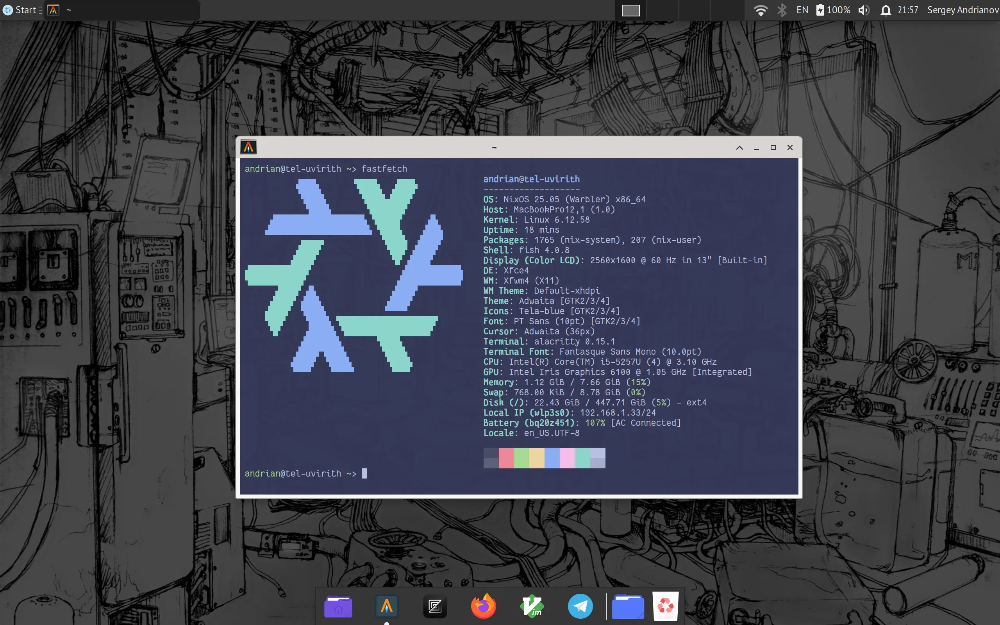

# ❄️ andrian's Nix Configuration

This is a flake with my personal NixOS and Nix-Darwin configurations.

## Hosts

### ald-ruhn

MacBook Pro M4, running macOS with Determinate Nix as a package manager.

### tel-uvirith

MacBook Pro Intel, running NixOS, dual-booting with OpenBSD.
