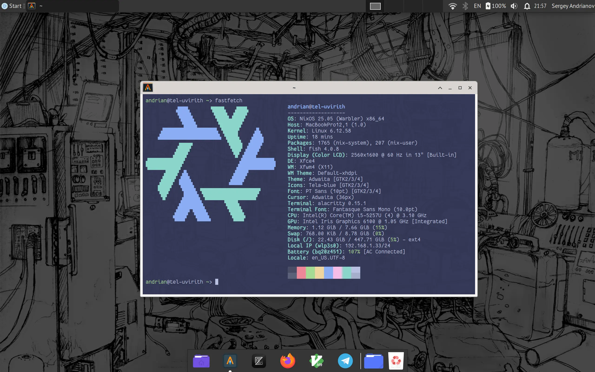

# ❄️ andrian's Nix Configuration

This is a flake with my personal NixOS and Nix-Darwin configurations.



## Hosts

### ald-ruhn

MacBook Pro M4, running macOS with Determinate Nix as a package manager.

### tel-uvirith

MacBook Pro Intel, running NixOS, dual-booting with OpenBSD.

## Structure

```
nix-config/
├── flake.nix           # Main flake configuration
├── parts/              # Flake-parts modules
│   ├── formatter.nix   # Code formatter (Alejandra)
│   ├── nixos.nix       # NixOS configurations
│   ├── darwin.nix      # nix-darwin configurations
│   └── home.nix        # Home Manager configurations
├── hosts/              # Host-specific system configurations
│   ├── ald-ruhn/
│   └── tel-uvirith/
├── home/               # Home Manager user configurations
├── modules/            # Reusable NixOS/Darwin/Home modules
└── config/             # Non-Nix configuration files (dotfiles)
```

## Features

- **Multi-system support**: Manages both NixOS (x86_64-linux) and macOS (aarch64-darwin) from a single flake
- **Flake-parts**: Modular flake organization for clean separation of concerns
- **Home Manager**: User environment management integrated with system configuration
- **Homebrew integration**: macOS packages via nix-homebrew for apps not available in nixpkgs
- **Determinate Nix**: Uses Determinate Systems' Nix distribution on macOS
- **Alejandra**: Consistent Nix code formatting
